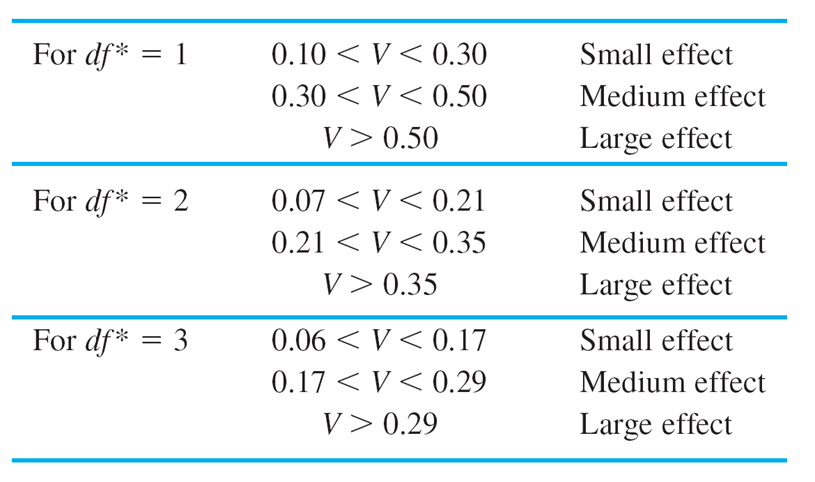
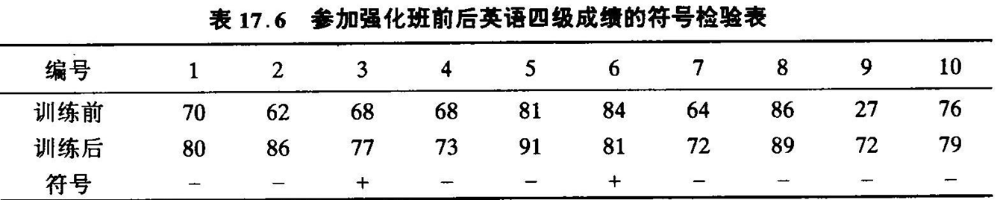
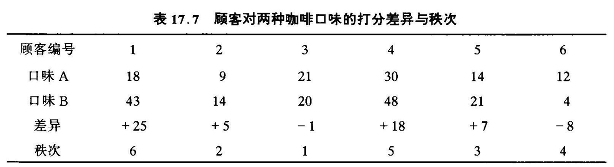
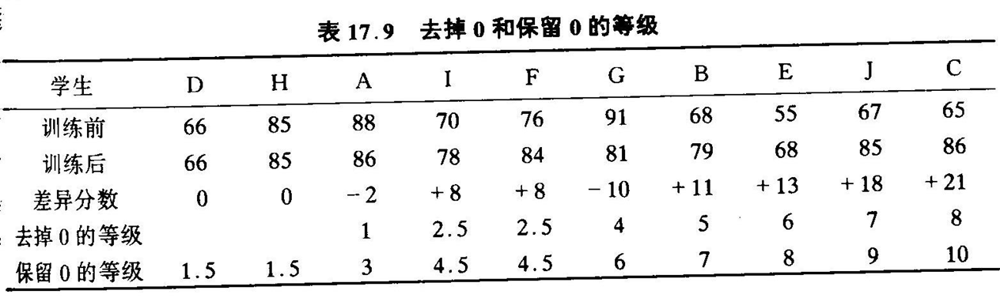
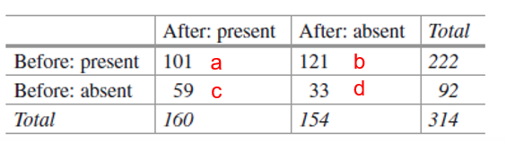
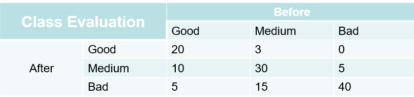
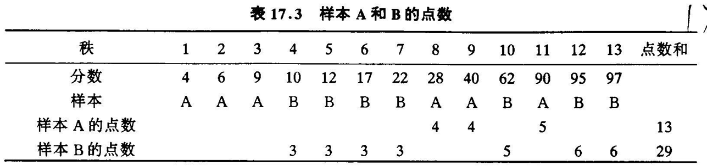

```{r setup, include=FALSE}
knitr::opts_chunk$set(echo = TRUE)
```

# Psychology Statistic Reference

## format

-   英文名称
-   中文名称
-   适用场景
-   原理
-   前提条件
-   代码实现
-   结果解读

# data type

## nominal data [名义数据]

## ordinal data [有序数据]

## interval data [区间数据]

## ratio data [比率数据]

# distribution

# plot

```         
```

## correlation [相关]

### Pearson correlation [皮尔逊相关]

### Spearman correlation [斯皮尔曼相关]

## regression [回归]

### linear regression [线性回归]

### multiple regression [多元回归]

### logistic regression [逻辑回归]

# parametric test [参数检验]

-   Parametric statistics assumes data come from a type of probability distribution (i.e., the parametric form of the distribution) and makes inferences about the parameters of the distribution.
-   Estimation is about estimating the parameters; Hypothesis testing is about deriving the sampling distribution of a test statistic (e.g., t, F). \> 参数统计假设数据源自某种概率分布类型（即分布的参数形式），并对分布的参数进行推断。 \> 估计是关于估计参数的；假设检验是关于推导出检验统计量（例如 t、F）的抽样分布。

## ANOVA

### one-way ANOVA [单因素方差分析]

### two-way ANOVA [双因素方差分析]

### repeated-measures ANOVA [重复测量方差分析]

### mixed-design ANOVA [混合设计方差分析]

## z-test [z 检验]

### one-sample z-test [单样本 z 检验]

### independent z-test [独立 z 检验]

### paired z-test [配对 z 检验]

## t-test [t 检验]

### one-sample t-test [单样本 t 检验]

### independent t-test [独立 t 检验]

### paired t-test [配对 t 检验]

# Non-parametric test [非参数检验]

-   Non-parametric statistics does not rely on data belonging to any particular distribution.
-   It makes fewer assumptions and is often used when data do not meet the assumptions necessary for parametric tests.

> 非参数统计不依赖于数据属于任何特定分布。 它做出更少的假设，通常在数据不满足参数检验所需的假设时使用。

When to use non-parametric tests:

-   Non-normality or skewness [非正态或偏态]
-   Outliers [异常值]
-   Small sample sizes (so cannot fully trust normality assumptions) [小样本量（因此无法完全信任正态性假设）]
-   Analyzing nominal or ordinal data (has a ranking but no clear numerical interpretation. E.g., your grades in the final exam, [B - A] = [D - C]?)[分析名义或有序数据（具有排名但没有明确的数值解释。例如，你在期末考试中的成绩，[B - A] = [D - C]？]

disadvantages of non-parametric tests:

-   Less powerful -- probability of rejecting the null hypothesis correctly is lower. [功效较低--拒绝零假设的正确概率较低]
-   Less precise [不够精确]

> A more powerful statistical method is one that is more sensitive and has a lower probability of making a Type II error when a true effect or difference exists.

> 更强大的统计方法是指更敏感且在真实效应或差异存在时发生 II 类错误的概率较低的方法。

## chi-square [卡方检验]

-   原理:

卡方检验比较观察到的和期望的频率，以评估样本分布是否符合原假设指定的总体分布。

它假设两者之间没有差异，并且不依赖于总体分布的具体形式，因此是一个非参数或模型自由的检验。 $$
H_0: 观测频次和期望频次相同\\
f_o = observed \space frequency\\
f_e = expected \space  frequency\\
\chi^2=\sum\frac{(f_o-f_e)^2}{f_e}\\
df = C-1\\
C是类别的数量，与样本大小无关。 
$$ 如果观测频数（$f_o$）和期望频数（$f_e$）之间存在很大的差异，那么卡方值将会很大，并且我们将拒绝原假设。

-   假设条件:

1.  **观测值的独立性**：每个个体的观测结果只能归入一个类别。也就是说，一个人的反应不能同时属于多个不同的类别，各个观测之间相互独立，不会相互影响。
2.  **期望频数的大小**：列联表中每个单元格的期望频数不应小于 5。
    -   **处理方法**：如果存在某个单元格的期望频数小于 5，就需要将该单元格与其相邻的单元格进行合并。

-   报告方式:

$$
\chi^2(3)=8.08,p=.044<.05
$$

### Chi square test for Goodness of Fit [拟合优度检验]

example:

选择一门课程的主要原因是什么?

| 选择一门课程的主要原因 | Interest | Easy to pass | Good teaching | Good course schedule | Total |
|----|----|----|----|----|----|
| 实际的人数 | 18 | 17 | 7 | 8 | 50 |
| 期望的人数 | 12.5 | 12.5 | 12.5 | 12.5 | 50 |

```{r}
# H_0: 4种原因存在同样的影响
rm(list = ls())
f_e <- c(rep(12.5, times = 4))
f_o <- c(18, 17, 7, 8)
chisq.test(f_o) # 不给出p的时候默认是均匀分布的
chisq.test(f_o, p = rep(1 / length(f_o), length(f_o))) # 参数p为目标概率分布
```

### Chi square test for independence [独立性检验]

-   适用条件:用于检验两个变量之间是否存在关联。

-   以矩阵形式呈现数据。

-   矩阵每个单元格中的数据是**频数**，而非等距 / 比率变量。

-   这是一个关于变量相关性 / 独立性的检验；我们需要一个类似于相关系数的指标，即克莱默（Cramer）的 φ 系数作为效应量来报告。

$$ 
    f_e(i,j) = \frac{\sum{f_o(*,j)}\sum{f_o(i,*)}}{N}\\ 
    N = total\space samples\\
    \chi^2=\sum_{i,j}\frac{(f_o(i,j)-f_e(i,j))^2}{f_e(i,j)}\\
    df = (r-1)(c-1)\\
    效应量 \\
    Cramer's \space \phi\\
    V=\Phi=\sqrt{\frac{\chi^2}{N\times df_{min}}}\\
    df_{min} = min\{r-1,c-1\}
    $$



example:

育儿方式是否取决于父母的政治倾向?

|                          |                    |                         |       |
|--------------------------|--------------------|-------------------------|-------|
| Practices                | Liberals(expected) | Conservatives(expected) | Total |
| Permissive(expected)     | 15(12.5)           | 10(12.5)                | 25    |
| Non-permissive(expected) | 5(7.5)             | 10(7.5)                 | 15    |
| Total                    | 20                 | 20                      | 40    |

```{r}
# 当两个变量之间不存在一致且可预测的关系时，这两个变量相互独立。
# 当两个变量相互独立时，其中一个变量（育儿方式）的频数分布在另一个变量（政治倾向）的所有类别中都将具有相同的形态（相同的比例）。

# H_0: 政治立场不会影响父母的教养方式
rm(list = ls())
contingency_table <- data.frame(c(15, 10), c(5, 10))
chisq.test(contingency_table, correct = FALSE)

# 计算cramer's v
# install.packages("rcompanion")

library(rcompanion)
contingency_matrix <- data.matrix(contingency_table)
cramerV(contingency_matrix) # 参数必须转换成矩阵
```

## binomial test [二项检验]

-   检验数据是否来自二项分布。

-   $H_0:p_{real}=p_{expected}(双尾检验)$

```{r}
rm(list = ls())
binomial_data <- rep(c(1, 2, 3), 100)
count_list <- table(binomial_data) # 统计数据中每个不同取值的出现次数。
print(count_list)
binom.test(
    x = count_list[[1]],
    n = count_list[[1]] + count_list[[2]] + +count_list[[3]],
    p = 1 / 3,
    alternative = "two.sided"
)
# x 表示成功的次数。
# n 表示试验的总次数。
# p 是原假设下二项分布的成功概率。
# alternative 参数指定备择假设的类型。'two.sided' 表示双侧检验，即备择假设是成功的概率不等于 p。
```

## Runs test [游程检验]

-   适用于二项分布数据

-   如果是随机过程，那么更有可能出现较短的连串（连续出现 1 或 0 ）。理想的连串情况更有可能意味着数据来自随机过程。

-   Run[游程]代表一个转换，比如从0到1或从1到0。

-   如果数据是连续型的（而非二项分布数据），我们可以通过中位数来划分数据以进行转换。（即确定一个分类标准将数据转化为二项分布数据）

-   $H_0:游程是随机的$

使用场景:

-   检验样本分组是否随机

-   检验判断是否完全随机

```{r}
library(DescTools)
rm(list = ls())
runs_data <- rep(c(1, 0), 1000)

RunsTest(runs_data,
    alternative = "two.sided",
    exact = TRUE
)
```

## K—S test [科尔莫哥洛夫-斯米尔诺夫检验]

适用场景:

-   检验样本分布与检验分布（任何分布）是否不同

-   针对正态分布、均匀分布、指数分布或泊松分布。

原理:

-   它与卡方检验（Chi-square test）类似,它通过以下方式比较两个累积分布函数(CDF)：

    -   $D=\sup_x|S(x)-F_0(x)|,其中sup代表上限或者上确界$

    -   D表示这两个累积分布函数（CDF）之间的最大差异。

    -   $H_0:数据分布与目标分布一致$

### one-sample K-S test [单样本 K-S 检验]

```{r}
rm(list = ls())
ks_data <- 1:100

norm0 <- rnorm(length(ks_data), mean(ks_data), sd(ks_data))
poisson0 <- rpois(length(ks_data), lambda = 1 / mean(ks_data))

ks.test(ks_data, norm0)
ks.test(ks_data, poisson0)
```

### two-sample K-S test [双样本 K-S 检验]

## kendall's tau [肯德尔 τ]

适用场景:

-   衡量两个有序变量(ordianl variables)之间的相关性的指标。

> example1:你在物理课上的排名与你在数学课上的排名会存在相关性吗？
>
> example2:一家公司某一年的营收与另一年的营收之间是否相关呢？在这种情况下，营收数据属于有序数据（它们在商业领域中的排名情况，见下文） 。

原理:

$$
\tau = \frac{一致的对数 - 不一致的对数}{n(n-1)/2}
$$

-   一致对：当$x_1 > x_2$且$y_1 > y_2$时，或者当$x_1 < x_2$且$y_1 < y_2$时，这样的配对为一致对。

-   不一致对则与之相反：当$x_1 > x_2$但$y_1 < y_2$时，或者当$x_1 < x_2$但$y_1 > y_2$时，这样的配对为不一致对。

-   共要计算$C_n^2$对关系

-   Kendall's tau（肯德尔等级相关系数）的取值范围是$[-1, 1]$。

    -   **取值为1**：表示两个变量之间存在完全正相关，即当一个变量的等级增加时，另一个变量的等级也严格按照相同顺序增加，所有的数据对都是一致对。
    -   **取值为-1**：表示两个变量之间存在完全负相关，即当一个变量的等级增加时，另一个变量的等级严格按照相反顺序变化，所有的数据对都是不一致对。
    -   **取值为0**：表示两个变量之间不存在等级相关关系，一致对和不一致对的数量大致相等，变量之间没有明显的单调关系。
    -   **取值在(-1,0)或(0,1)之间**：表示变量之间存在一定程度的相关关系，取值越接近$1$或$-1$，相关程度越强；取值越接近$0$，相关程度越弱。

-   $H_0:两组数据不存在相关关系(Z=0)$

```{r}
rm(list = ls())
data1 <- 1:50
data2 <- 50:1
cor.test(data1,
    data2,
    alternative = "two.sided",
    method = "kendall"
)
```

## kendall's W [肯德尔 W]

适用范围:

-   衡量不同评分员之间一致性

> example: 可以通过智商（IQ）和情商（EQ）来评估优秀程度。那么智商和情商的排名会相关吗 ？

原理:

-   是点二列相关的扩展：适用于超过两组的情况。

-   仅处理排名数据；不要求数据呈正态分布。

$$
W = \frac{\sum{R_i^2}-\frac{(\sum{R_i})^2}{N}}{\frac{1}{12}K^2(N^3-N)}=\frac{S}{S_{max}}\\
K是评分者数目\\
N是被评分者数目\\R_i是被评分者排名之和\\
$$

-   你也可以将肯德尔和谐系数W转换为斯皮尔曼相关系数。

-   斯皮尔曼相关系数用于衡量两个变量之间的相关性，而肯德尔W系数则用于衡量多个变量（这里指多个评分员）之间的“平均”相关性。

    -   $r_{spearman}=\frac{KW-1}{K-1}$

-   肯德尔和谐系数$W$的取值范围是$[0, 1]$，具体如下：

    -   **取值为**$0$：表示评分员之间完全不一致，即被评对象在不同评分员眼中的排序完全随机，没有任何一致性。例如，对于一组学生的成绩排名，不同评分员给出的排名完全不同，没有任何规律可循，此时肯德尔和谐系数$W$为$0$。
    -   **取值为**$1$：表示评分员之间完全一致，即所有评分员对被评对象的排序完全相同。比如，所有评分员对一组参赛选手的表现给出了完全一样的排名，这时肯德尔和谐系数$W$为$1$。
    -   **取值在**$(0,1)$之间：表示评分员之间存在一定程度的一致性，取值越接近$1$，说明评分员之间的一致性越高；取值越接近$0$，说明评分员之间的一致性越低。

```{r}
rm(list = ls())
data <- as.table(matrix(rep(1:5, 5), nrow = 5))
t(data)


library(irr)
# 注意矩阵的样式,行为不同rater,列为不同candidate
kendall(t(data))
```

> 肯德尔W系数显示出较高的值，表明评分员之间意见一致。
>
> 与此同时，卡方检验结果显著，表明对啤酒的评分存在差异。
>
> 这两种检验反映了不同的意义。

## sign test [符号检验]

适用场景:

-   与配对 t 检验类似的情况：重复测量、纵向研究、前测与后测对比等等。

-   当我们不关心差异的绝对大小时，（这种方法）也可用于不满足参数统计假设的等距数据或等比数据。将数据转换为二项变量，然后我们就可以使用二项分布。

原理:

-   计算正数的数目和负数的的数目,取较小的数

    -   $r = min\{N_{positive},N_{negative} \}$

-   r值越小，两组之间存在显著差异的可能性就越大。

    -   如果样本量较小（n \< 25），在二项分布的分布表中查找临界值$r_{df,\alpha}$

    -   如果样本量较大（n \> 25），可以使用$正态分布N(np,npq)的临界值Z_{\alpha}$

-   $H_0:两组数据之间没有显著差异$



## Wilcoxon signed-rank test [威尔科克森符号秩检验]

适用范围:

-   配对样本t检验的非参数版本

-   比符号检验更加敏感和详细,把差异也考虑到统计中

-   可以用于不满足参数统计的等距数据和等比数据

原理:

$$
T = min\{\sum{R_+},\sum{R_-}\}\\
差异按绝对值排序,从小到大\\
R_+是正的差异的秩次和\\
R-是负的差异的秩次和\\
$$

-   如果 T 足够小，那么其中一组更有可能比另一组小或者大。极端情况是 T = 0。对T查表可得显著性结果
-   如果样本量较大（n \> 25），T统计量将服从正态分布。因此，我们需要进行Z检验：
    -   $N(\frac{n(n-1)}{4},\sqrt{\frac{n(n+1)(2n+1)}{24})}$
-   当有的差异绝对值相同(可能为0)时,有两种处理的办法
    -   去除这一对数据,df也减小
    -   保留这一对数据,rank平分到两侧,df也减小 (一般使用这种方法)
    -   为0的时候有两种方法,不为0的时候只有第二种方法
-   example:





```{r}
rm(list = ls())
x <- 1:10
y <- 0:9

wilcox.test(x, y,
    alternative = "two.sided",
    paired = T,
    exact = F,
    correct = F
)

binom.test(sum(x > y),
    n = length(x),
    alternative = "two.sided"
)

# 数据不是分类数据，因此不能使用卡方检验或类似的针对分类数据的方法。
# 相反，使用Wilcoxon符号秩检验（Wilcoxon signed rank test）和二项检验（binomial test）更为合适。
# 这两种方法适用于连续型数据，尤其是在数据不服从正态分布的情况下，效果更好。
# wilcox.test 是用来检验两个相关样本（x 和 y）之间的差异是否显著，适合非正态分布的连续数据。
# binom.test 用来检验 x 大于 y 的次数是否与预期的概率相符，适用于事件次数的比较。
# 如果为0.5,则代表随机出现,即没有实际的效果,需要显著的不同于0.5才可以.
```

## McNemar test [麦克尼马尔检验]

适用条件:

-   二分或二元数据（例如，是否为病毒携带者）量化的两个相关样本进行检验。
-   用于评估 2×2 列联表中的边际同质性。

原理:

-   它检验的是从表格边际总和得出的比例之间的差异：$p_A = (a + b)/N$ 以及 $p_B = (a + c)/N$。
-   $H_0:治疗没有效果$
    -   a + b = a + c 或者 b + d = c + d 或者 b = c

$$
\chi^2=\frac{(b-c)^2}{b+c}\\
df = 1\\
$$

例子:

一位研究人员试图确定一种药物对某种特定疾病是否有疗效。



```{r}
rm(list = ls())
drug_effect <- matrix(c(101, 59, 121, 33),
    nrow = 2,
    dimnames = list(
        "before" = c("+", "-"),
        "after" = c("+", "-")
    )
)
drug_effect
mcnemar.test(drug_effect)
```

## Stuart-Maxwell test [斯图尔特-麦克斯韦检验]

适用场景:

-   配对样本：数据来自同一组样本的不同测量（例如，在两个时间点或两个条件下的分类数据）。

-   名义数据：变量是分类的，没有内在的顺序性（例如，性别、颜色、疾病类型等）。

-   多类别的情况：当每个分类变量有多个类别时,同时检验两个评价者在所有类别(N\*N)之间的边际同质性。

原理:

-   $H_0:治疗没有效果$

-   检验的统计量 $\chi^2$ 基本上与卡方检验的统计量类似，但它针对配对数据进行了调整。

$$
\chi^2 = \sum \frac{(O_{ij} - E_{ij})^2}{E_{ij}}
$$

其中： - \$ O\_{ij} \$ 是配对样本在第 $i$ 类别和第 $j$ 类别的观测频数， - \$ E\_{ij} \$ 是根据原假设计算的预期频数。

例子:



```{r}
rm(list = ls())
library(DescTools)
ClassEva <- as.table(matrix(c(20, 3, 0, 10, 30, 5, 5, 15, 40), nrow = 3, dimnames = list("before" = c("good", "medium", "bad"), "after" = c("good", "medium", "bad"))))
ClassEva

StuartMaxwellTest(ClassEva)
```

## Mann-Whitney U test [曼-惠特尼 U 检验]

适用场景：

-   作为独立t检验的非参数版本时使用。

-   数据为顺序量表形式时使用。

-   对于不满足参数统计假设的区间数据或比率数据也可使用。

原理:

1.  合并样本并排序： 将两个独立样本中的所有数据合并到一起，并根据这些数据的大小从小到大排序。每个数据点会被赋予一个秩（rank），即第一个最小的数赋秩1，第二小的数赋秩2，依此类推。如果有相同的数值，使用**平均秩**赋给这些相同值。

2.  计算每组样本的秩和： 对于每个样本组，计算该组所有数据的秩之和。假设有两个独立样本组 A 和 B ，则：

    -   样本组 A 的秩和为 $R_A$ ；
    -   样本组 B 的秩和为 $R_B$。

3.  计算U统计量： Mann-Whitney U检验的统计量 U 计算公式如下：

$$
   U_A = R_A - \frac{n_A(n_A + 1)}{2}\\
   U_B = R_B - \frac{n_B(n_B + 1)}{2}\\
$$ 其中：

-   $R_A$ 和 $R_B$ 分别是样本组 $A$ 和 $B$ 的秩和，

-   $n_A$ 和 $n_B$ 分别是样本组 $A$ 和 $B$ 的样本大小。

统计量 $U$ 的值可以由 $U_A$ 或$U_B$中的较小者来表示。

4.  计算p值： 根据样本大小 $n_A$ 和 $n_B$，可以通过查找Mann-Whitney U分布表或使用正态近似方法来计算p值。对于大样本，Mann-Whitney U检验的统计量近似服从正态分布，因此可以使用Z分数计算p值：

    $Z = \frac{U - \mu_U}{\sigma_U}$

    其中，$\mu_U$ 和 $\sigma_U$ 分别是U统计量的期望值和标准差，计算公式如下：

    $\mu_U = \frac{n_A n_B}{2}$

    $\sigma_U = \sqrt{\frac{n_A n_B (n_A + n_B + 1)}{12}}$

    然后根据计算出的Z值查标准正态分布表来得出p值，决定是否拒绝原假设。

简单理解就是按顺序排完数据之后按照下面的表的方式给两个样本赋点数,求和之后取较小的那一个作为统计量,点数取决前面有多说和他不是来自同一组的数据

例子:



```{r}
rm(list = ls())
two_samples_data <- data.frame(
    name = c(rep("A", 3), rep("B", 4), rep("A", 2), rep("B", 1), rep("A", 1), rep("B", 2)),
    grade = c(4, 6, 9, 10, 12, 17, 22, 28, 40, 62, 90, 95, 97)
)
two_samples_data

names(two_samples_data) # 查看列名

library(dplyr)

group1 <- two_samples_data %>%
    filter(name == "A") %>%
    select(grade) %>%
    pull()

group2 <- two_samples_data %>%
    filter(name == "B") %>%
    select(grade) %>%
    pull()


wilcox.test(
    x = group1, y = group2, alternative = "two.sided",
    paired = F
)
# 使用与威尔科克森检验相同的功能，但将数据指定为独立样本数据(paired = F)。
```

## Kolmogorov-Smirnov Z test [科尔莫哥洛夫-斯米尔诺夫 Z 检验]

适用场景:

-   与单样本柯尔莫戈洛夫 - 斯米尔诺夫（K - S）检验类似；

-   将两个分布（累积分布函数，CDFs）相互进行比较。适用于检测位置差异。

    -   适用于双独立样本
    -   实质是比较累计概率分布函数的最大差别

```{r}
rm(list = ls())
two_samples_data <- data.frame(
    name = c(rep("A", 3), rep("B", 4), rep("A", 2), rep("B", 1), rep("A", 1), rep("B", 2)),
    grade = c(4, 6, 9, 10, 12, 17, 22, 28, 40, 62, 90, 95, 97)
)
two_samples_data

names(two_samples_data) # 查看列名

library(dplyr)

group1 <- two_samples_data %>%
    filter(name == "A") %>%
    select(grade) %>%
    pull()

group2 <- two_samples_data %>%
    filter(name == "B") %>%
    select(grade) %>%
    pull()

ks.test(group1, group2,
    alternative = "two.sided"
)
```

## Moses Extreme Reactions Test [摩西极端反应检验]

-   当两组数据混合并排序后（剔除上下各 5%的数据），检查其中一组数据秩次的跨度。
-   适用于两端有较多数据集中的分布情况。
-   实质还是比较两个样本的range+1 (去掉极端值以后)。

```{r}
rm(list = ls())
two_samples_data <- data.frame(
    name = c(rep("A", 3), rep("B", 4), rep("A", 2), rep("B", 1), rep("A", 1), rep("B", 2)),
    grade = c(4, 6, 9, 10, 12, 17, 22, 28, 40, 62, 90, 95, 97)
)
two_samples_data

names(two_samples_data) # 查看列名

library(dplyr)

group1 <- two_samples_data %>%
    filter(name == "A") %>%
    select(grade) %>%
    pull()

group2 <- two_samples_data %>%
    filter(name == "B") %>%
    select(grade) %>%
    pull()


install.packages("DescTools")
library(DescTools)
MosesTest(group1, group2, NULL)
```

## Wald-Wolfowitz Runs Test [瓦尔德-沃尔夫维茨游程检验]

-   将两组数据放在一起进行排序；如果两组数据相似，那么组标签应该是混合排列的。
-   适用于方差差异比位置差异更显著的分布情况。
-   会生成一组组标签序列，统计在该序列中某一组标签交替出现的次数。游程的数量服从 Z 分布。

```{r}
two_samples_data <- data.frame(
    name = c(rep("A", 3), rep("B", 4), rep("A", 2), rep("B", 1), rep("A", 1), rep("B", 2)),
    grade = c(4, 6, 9, 10, 12, 17, 22, 28, 40, 62, 90, 95, 97)
)
two_samples_data

names(two_samples_data) # 查看列名

library(dplyr)

group1 <- two_samples_data %>%
    filter(name == "A") %>%
    select(grade) %>%
    pull()

group2 <- two_samples_data %>%
    filter(name == "B") %>%
    select(grade) %>%
    pull()

RunsTest(
    x = group1,
    y = group2,
    alternative = "two.sided",
    exact = T
)
```

### Friedman Test [弗里德曼检验]

适用场景:

-   重复测量数据的比较：当数据是重复测量的，即同一组受试者在不同时间点或不同条件下的测量结果，Friedman Test也适用。

-   适用于非正态分布的数据。

-   适用于小样本数据的分析。

原理：

1.  Friedman Test通过将原始数据转换为排名（rank），然后利用这些排名来评估不同组之间的差异是否具有统计学意义。
2.  对于每组（block,或者是一个评分者对于不同被评分者的评分）数据，按照从小到大的顺序进行排序，并赋予相应的秩次。如果有多个观测值相同(tied value)，则平分秩次。
3.  计算每个被评分者的排名总和。
4.  利用每个被评分者的排名总和，构建Friedman检验的统计量，该统计量反映了组间差异的程度。
5.  通过比较检验统计量与理论分布（通常是卡方分布）的临界值，确定是否存在统计学上的显著差异。

$H_0： \text{所有相关样本的中位数相等}$

$H_a： \text{至少有一个相关样本的中位数不等}$

$\chi^2(k-1) = \frac{12}{nk(k+1)}\sum{R^2-3n(k-1)}$

-   n is \# of raters (aka, b, the block); 评分者数目，在例子中为每行

-   k is \# of subject; 被评分者数目，在例子中为列

-   R is the total rank of a subject.

> 例子：
>
> 6个考官, 3个应聘者. 问题是3个应聘者是否得分不同.
>
> 

### Cochran's Q test [科克兰Q检验]

### kruskal-wallis test [克鲁斯卡尔-沃利斯检验]

Kruskal-Wallis 检验基于 $H$ 用于比较 $k$ 个总体分布 - **原假设 (H₀)**：$H_0$：$k$ 个总体分布是相同的。 - **备择假设 (Hₐ)**：$H_a$：至少有两个总体分布在位置上存在差异。

检验统计量 检验统计量 $H$ 的计算公式为：

$H = \frac{12}{n(n + 1)} \sum_{i=1}^{k} \frac{R_i^2}{n_i} - 3(n + 1)$

其中：

-   $n_i$ = 第 $i$ 个总体样本的观测值数量，

-   $R_i$ = 第 $i$ 个样本的秩和（即每个观测值在其相对大小的整体 $n = n_1 + n_2 + \cdots + n_k$ 个观测值中的排名之和）。

拒绝域 如果检验统计量 $H$ 大于自由度为 $k - 1$ 的卡方分布的临界值 $\chi_{\alpha}^2$，则拒绝原假设 $H_0$。

假设条件

-   $k$ 个样本是随机且独立抽取的。

-   每个样本中有五个或更多的观测值。
